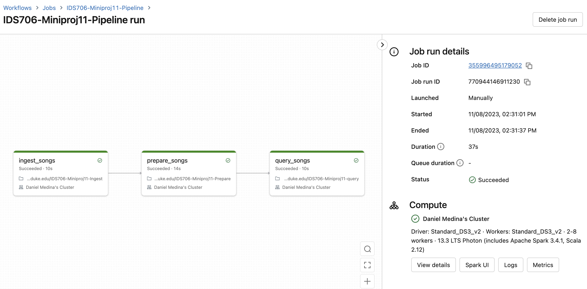

# IDS 706 Mini Project 11
#### By Daniel Medina
In this project, I built an end-to-end databricks pipeline from raw music data. After performing exploratory data analysis, the pipeline ingests the data, prepares it using Spark, and performs some SQL queries on it.
## Pipeline Structure

